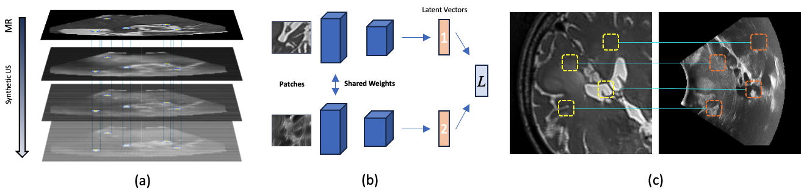

## Learning to Match 2D Keypoints Across Preoperative MR and Intraoperative Ultrasound

This repository contains the implementation of our novel method for matching preoperative Magnetic Resonance (MR) images with intraoperative Ultrasound (US) images. The approach is based on texture-invariant keypoint descriptors, specifically designed to address the challenges of multimodal image matching in medical imaging.

### Overview
Our method introduces a matching-by-synthesis strategy, where intraoperative US images are synthesized from MR images, considering multiple MR modalities and the variability of intraoperative US. The keypoint descriptors are trained in a supervised contrastive manner to be invariant to texture changes and robust against speckle noise.

### Key Features
- **Texture-invariant Keypoint Descriptors**: Designed for robust matching of MR and US images.
- **Matching-by-Synthesis**: Synthesizes US images from MR images to create a diverse training set.
- **Supervised Contrastive Learning**: Trains descriptors to focus on structural similarity and ignore texture variations.
- **Patient-specific Training**: Tailors the model to individual patients for improved performance.
- **Siamese Network Architecture**: Utilizes a Siamese network to learn discriminative descriptors for cross-modality matching.

### Performance
Our experiments on real patient data demonstrate that our approach significantly outperforms state-of-the-art methods, achieving an average matching precision of 80.35%.

### Dataset
We used the ReMIND dataset: Juvekar, Parikshit, et al. "ReMIND: The Brain Resection Multimodal Imaging Database." Scientific Data 11.1 (2024): 494.

### Repository Contents
- **Code**: Implementation of the keypoint descriptor network, image synthesis pipeline, and matching algorithms.
- **Training Data**: Scripts for generating synthetic US images from MR images and creating the training dataset.
- **Evaluation**: Tools for evaluating the performance of the descriptors on real patient data with ground truth.

### Usage
To use this repository, follow these steps:

1. **Clone the repository**:
    ```sh
    git clone https://github.com/hassanrasheedk/crossfeat2d.git
    ```

2. **Install the required dependencies**:
    ```sh
    pip install -r requirements.txt
    ```

3. **Train the Model**:
    Train the keypoint descriptor network using the train notebook.

4. **Evaluate the Model**:
    Evaluate the trained model on real patient data using the inference notebook.

### Results
Our method achieves an average matching precision of 80.35%, significantly outperforming existing methods.

### Figures
The following figure illustrates our method overview:


### Citation
If you use this code in your research, please cite our paper:
```
@article{Rasheed2024,
title={Intraoperative MR-Ultrasound Image Matching via Texture-invariant Keypoint Descriptors},
author={Rasheed, Hassan and Dorent, Reuben and Fehrentz, Maximilian and Kapur, Tina and Wells, William M. and Golby, Alexandra and Frisken, Sarah and Schnabel, Julia and Haouchine, Nazim},
volume={11},
number={1},
pages={494},
year={2024},
conference={MICCAI - ASMUS 2024},
publisher={Springer}
}
```

### License
This project is licensed under the [MIT License](LICENSE).
